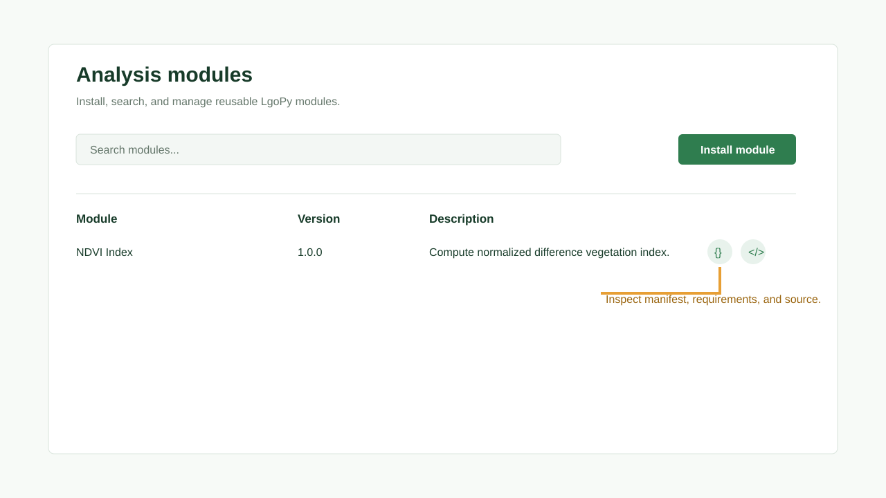
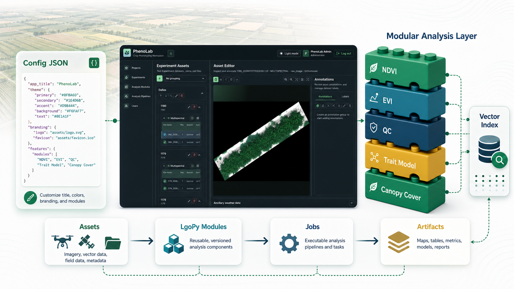

# Analysis Modules

Analysis modules are reusable, versioned LgoPy components that can be searched, inspected, installed, and removed from PhenoLab.



PhenoLab treats analysis modules as a modular method layer for research workflows. The platform stays crop-agnostic, while crop-specific measurements are added as LgoPy components that can be packaged, installed, searched, reviewed, and combined in pipelines.



## When to Use

Use analysis modules when you want reusable methods for vegetation indices, canopy metrics, spectral feature extraction, quality control, or crop-specific trait estimation in a dataset pipeline.

## Step-by-Step Usage

1. Open **Analysis Modules**.
2. Search the installed catalog.
3. Inspect a module manifest to verify name, version, schema, and metadata.
4. View source when you need to understand implementation details.
5. View requirements before installing or running a module with optional dependencies.
6. Install a zipped module package when adding a new analytical component.
7. Remove outdated modules when they should no longer be available.

## CLI Usage

Inspect the current LgoPy catalog directory, semantic-search status, embedding model, and pgvector database target:

```bash
phenolab analysis-blocks config
```

List or search installed blocks:

```bash
phenolab analysis-blocks list
phenolab analysis-blocks search "vegetation index"
phenolab analysis-blocks search --category spectral --tag ndvi
```

Build and install a local module package:

```bash
uv run python scripts/blocks/build_ndvi_package.py
phenolab analysis-blocks install scripts/dist/ndvi_index
```

Inspect implementation details before using a block:

```bash
phenolab analysis-blocks source ndvi_index --version 0.1.0
phenolab analysis-blocks requirements ndvi_index --version 0.1.0
```

Remove a module version when it should no longer be available:

```bash
phenolab analysis-blocks remove ndvi_index --version 0.1.0
```

## LgoPy Vector Index

The file-backed catalog stores installed module packages under `PHENOLAB_ANALYSIS_BLOCK_CATALOG_DIR`, defaulting to `~/.phenolab/blocks`.

For semantic search, PhenoLab bridges its PostgreSQL settings into the LgoPy catalog vector-index environment:

| LgoPy variable | Source |
| --- | --- |
| `LGOPY_CATALOG_DB_DRIVER` | Derived from `PHENOLAB_DATABASE_URL` or PostgreSQL settings. |
| `LGOPY_CATALOG_DB_HOST` | `PHENOLAB_DB_HOST` |
| `LGOPY_CATALOG_DB_PORT` | `PHENOLAB_DB_PORT` |
| `LGOPY_CATALOG_DB_NAME` | `PHENOLAB_DB_NAME` |
| `LGOPY_CATALOG_DB_USER` | `PHENOLAB_DB_USER` |
| `LGOPY_CATALOG_DB_PASSWORD` | `PHENOLAB_DB_PASSWORD` |

Set `GOOGLE_API_KEY` to enable Gemini embeddings for semantic discovery of analytical methods. Optionally set `LGOPY_CATALOG_GEMINI_EMBEDDING_MODEL_ID`; otherwise PhenoLab uses `gemini-embedding-001`.

## Best Practices

- Review requirements before running externally developed modules.
- Use versioned module packages for reproducible pipeline runs.
- Keep module display names concise and descriptions specific.
- Prefer focused, composable modules over one large analysis script.
- Keep module inputs explicit so the pipeline wizard can expose clear controls.

## Limitations

- A module must expose a compatible manifest and schema to appear correctly in the pipeline wizard.
- Dependency installation may require the local environment to satisfy package requirements.
- Semantic search requires PostgreSQL plus `GOOGLE_API_KEY`; deterministic catalog search works without embeddings.
