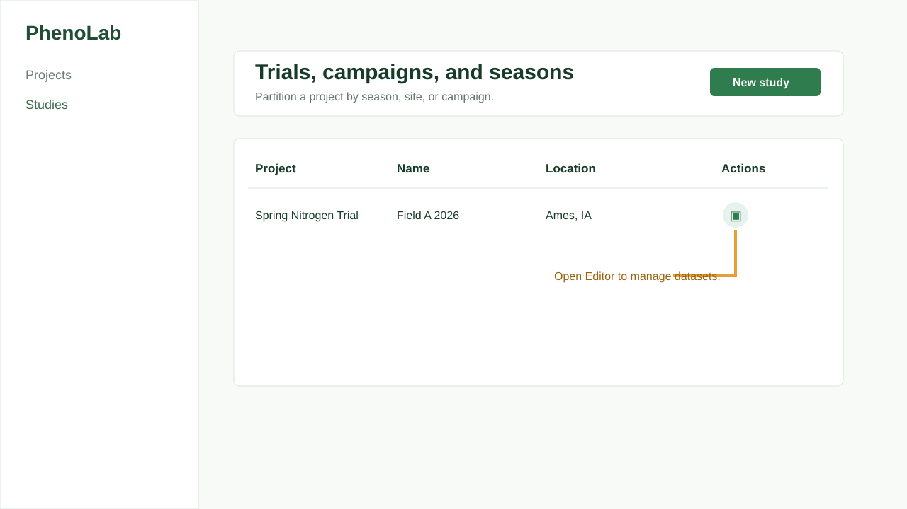

# Studies and Field Context

Studies partition a project by trial, season, site, management zone, campaign, or supporting documentation context.

## When to Use

Use studies to separate field seasons, sites, management zones, acquisition campaigns, or document sets inside a project. A study gives datasets and uploaded reference files a clear project-level context.

## Step-by-Step Usage

1. Open **Studies**.
2. Select **New study**.
3. Choose the parent project.
4. Enter the study name.
5. Add a description.
6. Add season, site, campaign, or documentation context when available.
7. Save the study.
8. Open **Editor** to manage datasets, files, plots, and images for the study.

## Tips

- Use study descriptions for field, crop, treatment family, season, or research context.
- Keep one study aligned with one operational field campaign or coherent document set.
- Open the editor when moving from metadata setup into data import.

## Limitations

Study records provide organizational context. Dataset-specific acquisition details, modality settings, plots, and assets are managed in the editor.
