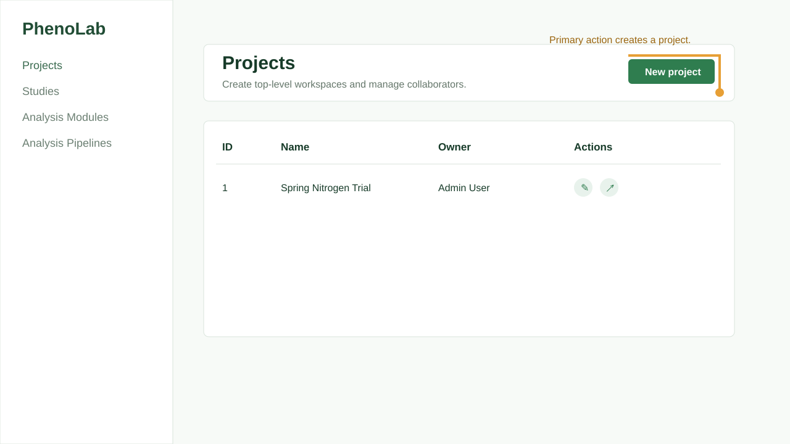

# First Project

This page walks through the first study hierarchy you should create after signing in.

Annotated Projects page placeholder. Replace with a captured screenshot from your running app when publishing.

## Create the Project

1. Open **Projects** from the sidebar.
2. Select **New project**.
3. Enter a concise project name, such as `Spring Nitrogen Trial`.
4. Confirm the owner.
5. Add a description that explains the crop, site, and season.
6. Save the project.

## Create a Study

1. Open **Studies**.
2. Select **New study**.
3. Choose the project.
4. Enter a season, site, or campaign name.
5. Add any project context that should travel with this study.
6. Save the study.

## Open the Dataset Editor

Open **Editor** from the sidebar. The editor is where you browse projects and studies, create datasets and plots, upload files, register assets, preview imagery, and work with annotations.

:::tip

Keep one dataset focused on one acquisition event or batch. This makes pipeline runs and output review easier to trace.

:::
