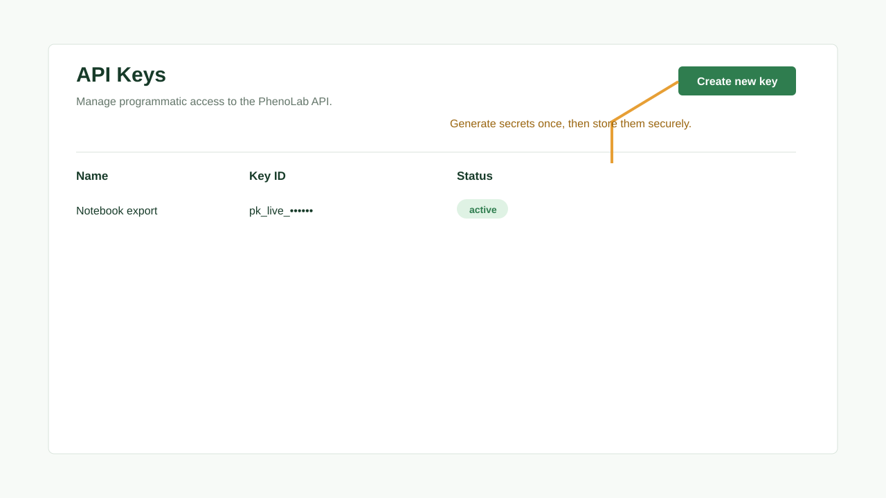

# Tutorial: Configuring Settings

## Objective

Configure database, data directory, branding, and API access for a local PhenoLab web-platform environment.

## Prerequisites

- Repository checkout is available.
- PostgreSQL is available.
- You can set environment variables in your shell.

## Estimated Time

15 minutes.

## Steps

1. Set database variables.
2. Set `PHENOLAB_DATA_DIR`.
3. Choose the public app config file.
4. Start the backend.
5. Start the frontend.
6. Open the app and verify the title, subtitle, and theme.
7. Create an API key when scripted access is needed.

## Expected Result

The UI uses the selected public config, backend requests target the expected database, and generated API keys can authenticate script requests.

## Common Mistakes

- Changing `AUTH_SECRET` or `NEXTAUTH_SECRET` between runs and invalidating sessions.
- Starting Next.js without `NEXT_PUBLIC_PHENOLAB_API_BASE_URL` pointing to the backend.
- Editing a config file while `.env` still points to another file.

## Tips

Verify public config through the backend `/api/config` response when branding does not match what you expect.
