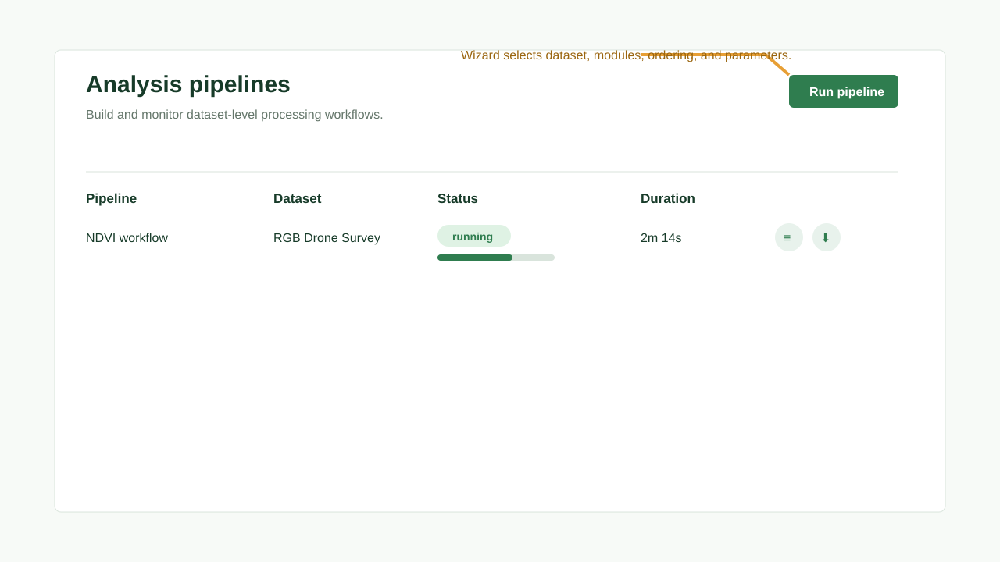

# Tutorial: Running a Workflow

## Objective

Review the retained analysis-pipeline payload flow and use operation-backed processing for active work.

## Prerequisites

- At least one analysis module is installed.
- The embedded worker or deployment worker path is available.

## Estimated Time

10 minutes for review; active pipeline execution is temporarily disabled.

## Steps

1. Open **Analysis Modules**.
2. Confirm that the required module appears in search.
3. Open **Analysis Pipelines**.
4. Select **Run pipeline** if you need to inspect the retained builder surface.
5. Choose the project, study, and dataset.
6. Select modules.
7. Reorder modules if needed.
8. Configure parameters.
9. Review the pipeline graph and JSON payload.
10. Do not rely on `/api/pipelines` for execution in this checkout; it currently returns `501`.
11. Use upload and file-processing operations for active background processing.

## Expected Result

The pipeline payload can be reviewed, and active background work should be tracked through operation-backed upload or file-processing flows.

## Common Mistakes

- Assuming `/api/pipelines` is active before the operation-backed pipeline path is restored.
- Stopping the backend or worker path before the queue finishes.
- Retrying without reading the error log.

## Tips

Use a small dataset first when validating a new module or parameter set once pipeline execution is restored.
