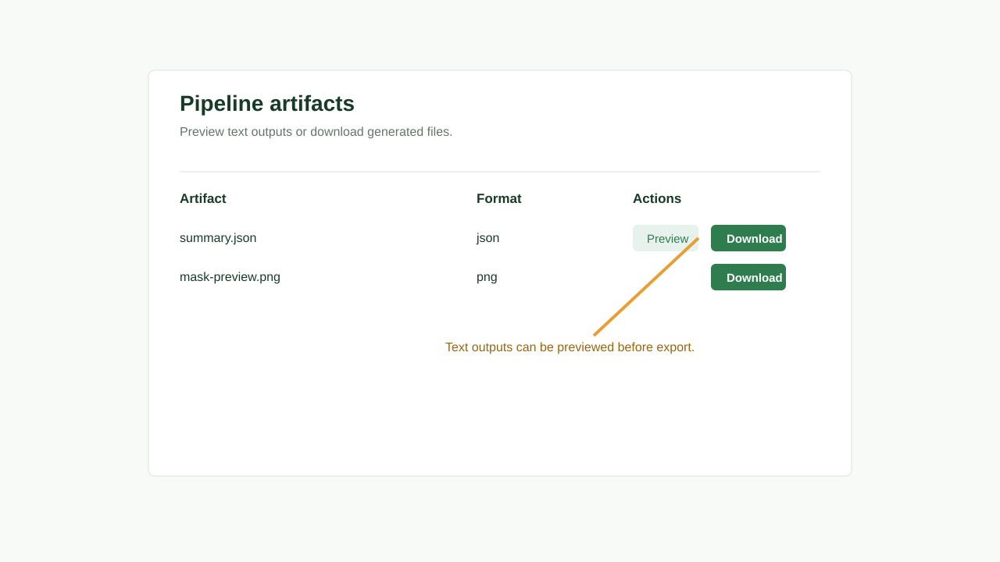

# Tutorial: Viewing and Exporting Results

## Objective

Inspect logs, preview artifacts, and export output files from completed processing workflows.

## Prerequisites

- A processing operation has completed.
- The signed-in user can access the project.

## Estimated Time

10 minutes.

## Steps

1. Open the surface that owns the completed operation or artifact.
2. Find the completed operation.
3. Open the log dialog.
4. Review progress messages and any warnings.
5. Open artifacts.
6. Preview text artifacts when available.
7. Download output files.

## Expected Result

You have local copies of the output artifacts and enough log context to trace how the result was produced.

## Common Mistakes

- Exporting artifacts from the wrong operation or dataset.
- Sharing a JSON summary without the dataset and module version context.

## Tips

Use API keys for repeatable exports from scripts.
